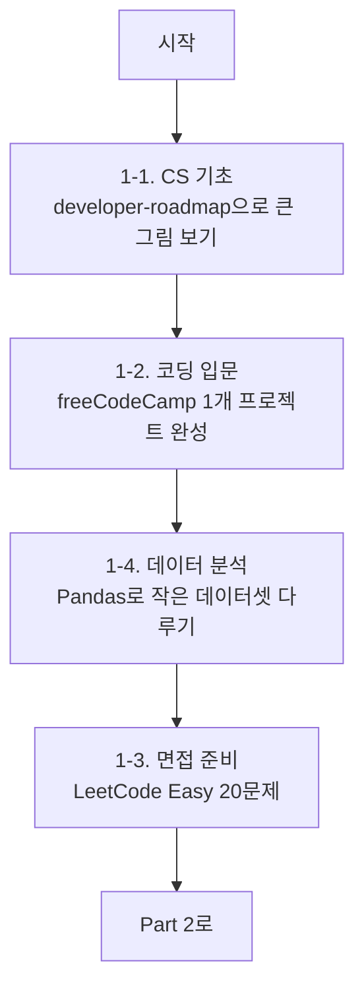

# Part 1: 개발 기초 다지기

> 이 파트는 프로그래밍을 처음 시작하는 분들을 위한 "선배가 옆에서 과외해주는" 기초 가이드입니다.
> CS 기초부터 코딩 입문, 면접 준비, 데이터 분석까지 단계별로 차근차근 따라오시면 됩니다.

!!! info "📌 이 파트를 위한 3줄 요약"
    - 비전공자가 개발자로 성장하기 위한 **가장 빠르고 체계적인 길**을 알려드립니다.
    - 각 레포는 **"왜 봐야 하는지 → 15분 퀵스타트 → Claude Code로 200% 활용"** 순으로 구성했습니다.
    - 막히는 부분이 있어도 걱정 마세요. 단계별 체크리스트와 "자주 발생하는 에러" 섹션이 함께합니다.

---

## 학습 목표

이 파트를 끝까지 학습하면 다음 역량을 갖추게 됩니다.

- [ ] 컴퓨터 과학(CS)의 기본 개념을 내 말로 설명할 수 있다
- [ ] Python 또는 JavaScript로 간단한 프로그램을 혼자 만들 수 있다
- [ ] Git으로 버전 관리를 할 수 있고, GitHub에 코드를 올릴 수 있다
- [ ] LeetCode Easy 문제 10개 이상을 스스로 풀 수 있다
- [ ] Pandas로 CSV 파일을 읽고 간단한 분석 리포트를 만들 수 있다

---

## 이 파트의 구성

| 챕터 | 주제 | 난이도 | 예상 소요 |
|------|------|--------|-----------|
| [1-1. CS 기초 다지기](01-cs-basics.md) | OSSU, developer-roadmap, coding-interview-university | ⭐⭐ | 4~12주 |
| [1-2. 코딩 입문 - 실전 프로젝트](02-coding-entry.md) | freeCodeCamp, TheOdinProject, build-your-own-x | ⭐⭐ | 6~16주 |
| [1-3. 면접 준비](03-interview-prep.md) | tech-interview-handbook, system-design-primer, interviews | ⭐⭐⭐ | 8주 |
| [1-4. 데이터 분석 & 시각화](04-data-analysis.md) | Pandas, Matplotlib, Streamlit | ⭐⭐ | 4주 |

---

## 학습 로드맵 (추천 순서)

!!! tip "💡 꿀팁: 한 번에 하나씩"
    욕심내서 여러 카테고리를 동시에 시작하지 마세요.
    **한 주제를 끝낸 뒤 다음으로 넘어가는 것**이 장기적으로 훨씬 빠릅니다.

### 4개월 모델 스케줄 (주 15시간 기준)

| 주차 | 할 일 | 산출물 |
|------|-------|--------|
| **1~2주** | developer-roadmap 읽기 + Git 기초 | GitHub 프로필 생성, 첫 커밋 |
| **3~6주** | freeCodeCamp Responsive Web Design | 포트폴리오 페이지 1개 |
| **7~10주** | Python + Pandas 데이터 분석 | Jupyter Notebook 리포트 1개 |
| **11~14주** | LeetCode Easy 20문제 + system-design 기초 | 풀이 저장소 1개 |
| **15~16주** | 복습 + 약점 보완 | 회고 블로그 1편 |

---

## 시작하기 전에 준비할 것

!!! warning "⚠️ 꼭 미리 설치해두세요"
    아래 도구가 없으면 실습을 진행할 수 없습니다. 처음이라 막막하시다면 Claude Code에게 물어보세요.

- [ ] **Git** 설치 (`git --version`으로 확인)
- [ ] **Python 3.10+** 설치 (`python --version`으로 확인)
- [ ] **Node.js 20+** 설치 (`node --version`으로 확인)
- [ ] **VS Code** 또는 **Cursor** 에디터 설치
- [ ] **GitHub 계정** 생성

!!! example "🤖 Claude Code 프롬프트: 환경 점검"
    > "내 Windows 11 PC에 개발 환경이 잘 설정되어 있는지 점검해줘. Git, Python, Node.js 버전을 확인하고 부족한 것이 있으면 설치 방법을 알려줘."

!!! danger "🚨 자주 발생하는 에러: PATH 설정"
    **에러**: `'python' is not recognized as an internal or external command`
    **원인**: Python 설치 후 환경 변수 PATH에 등록되지 않음
    **해결**: Python 설치 시 `Add Python to PATH` 체크박스를 반드시 선택하거나, 시스템 환경 변수에 수동으로 추가.

---

준비가 되셨나요? 그럼 [1-1. CS 기초 다지기](01-cs-basics.md)부터 시작해볼까요!
