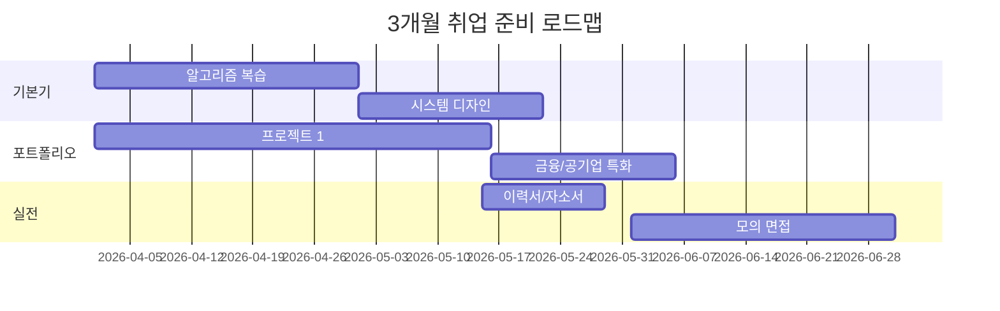

# Part 6: 취업 준비 및 면접 전략

> 금융권/공기업/대기업 IT 취업을 목표로 하는 분들을 위한 실전 준비 가이드입니다.
> 각 레포지토리를 **"왜 봐야 하는지 → 어떻게 써야 하는지 → 면접에서 어떻게 어필하는지"** 순서로 안내합니다.

!!! info "📌 이 파트를 위한 3줄 요약"
    - **기술 면접 준비**는 유명 3대 레포(tech-interview-handbook, system-design-primer, interviews)로 뼈대를 잡습니다.
    - **금융/공기업**은 Quant, OpenBB, OWASP, Kubernetes, GitHub Actions 같은 **업계 특화 레포**로 차별화합니다.
    - 각 레포마다 **Claude Code 프롬프트**를 함께 제공하니 그대로 복사해서 쓰세요.

---

## 학습 목표

- [ ] 기술 면접 핵심 주제(자료구조/알고리즘/시스템 디자인)를 정리할 수 있다
- [ ] 금융권/공기업 면접에서 어필할 수 있는 포트폴리오 프로젝트 1개 이상 보유
- [ ] 시스템 디자인 40분 프레임워크를 말로 설명할 수 있다
- [ ] 포트폴리오/이력서를 한 페이지로 최적화할 수 있다

---

## 이 파트의 구성

| 챕터 | 주제 | 난이도 | 예상 소요 |
|------|------|--------|-----------|
| [6-1. 기술 면접 준비](01-tech-interview.md) | tech-interview-handbook, system-design-primer, interviews | ⭐⭐⭐ | 8주 |
| [6-2. 금융/공기업 취업 레포](02-finance-public.md) | QuantConnect, OpenBB, OWASP, Kubernetes, GitHub Actions | ⭐⭐⭐⭐ | 6~12주 |

---

## 취업 준비 타임라인 (최소 3개월)

!!! tip "💡 꿀팁: 금융권과 일반 기업의 차이"
    - **금융권**: 보안/안정성/문서화 + Java/Spring Boot 중심
    - **공기업**: NCS 코딩테스트 + 인적성 + 자소서 비중 높음
    - **일반 IT**: 실무 프로젝트 임팩트 + 최신 스택 (React, Go, K8s)

---

## 파트 진입 전 준비

!!! warning "⚠️ 이 파트는 Part 1~5를 마친 후 보는 것을 권장합니다"
    - Part 1: 기본 CS 지식
    - Part 2: 프레임워크/언어 역량
    - Part 3: 포트폴리오 프로젝트
    - Part 4: 문서/리포트 작성 도구
    - Part 5: Claude Code 활용 능력

    이 기반이 없으면 면접 자체가 안 됩니다. 기초부터 탄탄히 쌓으세요.

!!! example "🤖 Claude Code 프롬프트: 준비도 자가 진단"
    > "나는 Java/Spring Boot로 SSAFY를 수료했고 포트폴리오는 2개 있어. 금융권 백엔드 신입 지원을 목표로 할 때 지금 어떤 점이 부족한지 자가 진단 체크리스트 20개를 만들어줘."

---

준비가 되셨다면 [6-1. 기술 면접 준비](01-tech-interview.md)부터 시작하세요!
